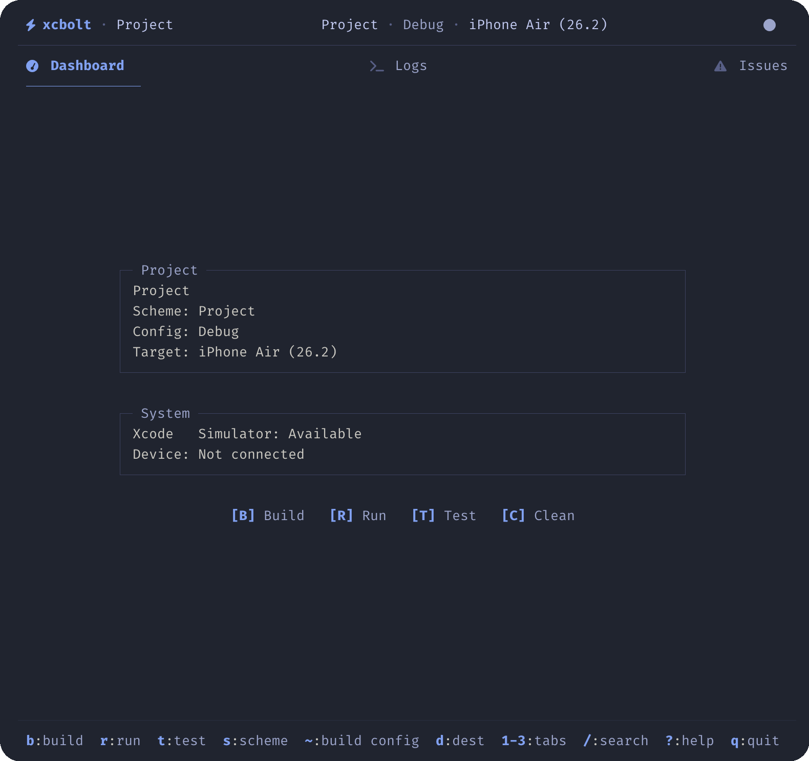

# ⚡ xcbolt

**A modern Xcode CLI and interactive TUI that humans and AI agents both love.**


<p align="center">
  
</p>

---

## Highlights

- **Interactive TUI** — Card-based dashboard with live build progress, errors, and quick actions
- **CLI Power** — Full `xcodebuild` control with NDJSON output for CI/CD pipelines
- **AI-Friendly** — Structured JSON events perfect for agent orchestration and automation
- **Zero Config** — Auto-detects workspaces, schemes, simulators, and devices
- **Unified Tooling** — Build, test, run, and manage simulators/devices in one tool

---

## Installation

**Homebrew (recommended):**
```bash
brew install vburojevic/tap/xcbolt
```

**From source:**
```bash
git clone https://github.com/xcbolt/xcbolt.git
cd xcbolt
go build -o xcbolt ./cmd/xcbolt
```

---

## Quick Start

```bash
# 1. Navigate to your Xcode project
cd ~/Projects/MyApp

# 2. Initialize config (optional — auto-config works for simple projects)
xcbolt init

# 3. Launch the TUI
xcbolt
```

---

## Interactive TUI

Launch with `xcbolt` or `xcbolt tui`. The interface has three tabs:

| Tab | Description |
|-----|-------------|
| **Dashboard** | Card-based dashboard with project info and build status |
| **Logs** | Real-time build output with search and filtering |
| **Issues** | Errors and warnings extracted for quick navigation |

### Keybindings

**Actions:**
| Key | Action | Key | Action |
|-----|--------|-----|--------|
| `b` | Build | `c` | Clean |
| `r` | Run | `x` | Stop app |
| `t` | Test | `esc` | Cancel |

**Navigation:**
| Key | Action | Key | Action |
|-----|--------|-----|--------|
| `1` | Dashboard tab | `s` | Select scheme |
| `2` | Logs tab | `d` | Select destination |
| `3` | Issues tab | `Ctrl+K` | Command palette |
| `tab` | Next tab | `i` | Init wizard |
| `~` | Build config | `Ctrl+R` | Refresh context |

**Search & View:**
| Key | Action | Key | Action |
|-----|--------|-----|--------|
| `/` | Search logs | `v` | Toggle logs view |
| `n` / `N` | Next/prev error | `e` / `E` | Expand/collapse all |
| `o` | Open in Xcode | `O` | Open in $EDITOR |
| `y` | Copy line | `Y` | Copy visible content |
| `?` | Help | `q` | Quit |

**Display toggles:**
| Key | Action | Key | Action |
|-----|--------|-----|--------|
| `L` | Toggle line numbers | `T` | Toggle timestamps |
| `F` | Toggle errors-only filter | `f` | Toggle logs view |
| `m` | Toggle mouse mode | `enter`/`space` | Toggle phase collapse |

**Scrolling:** `j`/`k`, arrows, `PgUp`/`PgDn`, `Ctrl+U`/`Ctrl+D`, `g`/`G` (top/bottom)

---

## CLI Commands

### Build Commands

| Command | Description |
|---------|-------------|
| `xcbolt build` | Build the configured scheme |
| `xcbolt test` | Run tests |
| `xcbolt run` | Build, install, and launch on selected simulator/device/mac target |
| `xcbolt clean` | Clean derived data |

### Info & Setup

| Command | Description |
|---------|-------------|
| `xcbolt init` | Interactive setup wizard |
| `xcbolt context` | Show project context (schemes, destinations) |
| `xcbolt doctor` | Validate Xcode environment |
| `xcbolt config` | Show current config (`--edit` to open in $EDITOR, `--migrate` to upgrade schema) |

### Simulator Management

| Command | Description |
|---------|-------------|
| `xcbolt simulator list` | List available simulators |
| `xcbolt simulator boot <udid>` | Boot a simulator |
| `xcbolt simulator shutdown <udid>` | Shutdown a simulator |

### Device Management

| Command | Description |
|---------|-------------|
| `xcbolt device list` | List connected physical devices |

### Other

| Command | Description |
|---------|-------------|
| `xcbolt logs` | Stream simulator/device logs |
| `xcbolt apps` | List installed apps |
| `xcbolt stop <bundle-id>` | Stop a running app |

### Examples

```bash
# Build with scheme override
xcbolt build --scheme MyScheme --configuration Release

# Run on a specific tvOS simulator
xcbolt run --platform tvos --target-type simulator --target "<simulator-udid-or-name>"

# Run on local Mac
xcbolt run --platform macos --target-type local

# Run watchOS on physical device (companion-driven)
xcbolt run --platform watchos --target-type device --target "<watch-udid-or-name>" --companion-target "<iphone-udid-or-name>" --console

# Stop watch session (also attempts to stop companion app on paired iPhone)
xcbolt stop <watch-bundle-id>

# Stream logs with predicate filter
xcbolt logs --predicate 'process == "MyApp"'

# List tests without running
xcbolt test --list

# Run specific tests (format: <Target>/<Class>/<testMethod>)
xcbolt test --only "MyAppTests/LoginTests/testLoginSuccess"

# Skip specific tests
xcbolt test --skip "MyAppTests/SlowTests"
```

---

## CI/CD Integration

All commands support NDJSON event streaming with the `--json` flag:

```bash
xcbolt --json build
xcbolt --json test | jq '.type'
```

`--event-version` controls the schema version for NDJSON output (current: `2`).

**Event types emitted:**

| Type | Description |
|------|-------------|
| `log` | Build output line |
| `log_raw` | Raw (unformatted) build output line |
| `error` | Error message |
| `warning` | Warning message |
| `result` | Operation result with data |
| `status` | Status update |

---

## Releases

Tag pushes (`v*`) trigger the GitHub Actions release workflow (GoReleaser). To avoid asset upload conflicts, do not run local `goreleaser release` for tag pushes—let CI publish the release.

---

## Configuration

Running `xcbolt init` creates `.xcbolt/config.json`:

```json
{
  "version": 3,
  "workspace": "MyApp.xcworkspace",
  "scheme": "MyApp",
  "configuration": "Debug",
  "destination": {
    "kind": "simulator",
    "platformFamily": "ios",
    "targetType": "simulator",
    "id": "...",
    "name": "iPhone 16 Pro"
  },
  "derivedDataPath": ".xcbolt/DerivedData",
  "resultBundlesPath": ".xcbolt/Results",
  "xcodebuild": {
    "logFormat": "auto",
    "logFormatArgs": []
  },
  "launch": {},
  "tui": {}
}
```

| Field | Description |
|-------|-------------|
| `workspace` / `project` | Path to `.xcworkspace` or `.xcodeproj` |
| `scheme` | Build scheme name |
| `configuration` | Build configuration (`Debug` / `Release`) |
| `destination` | Target simulator/device/local destination across Apple platforms |
| `derivedDataPath` | Custom derived data path (default: `.xcbolt/DerivedData`) |
| `resultBundlesPath` | Custom result bundles path (default: `.xcbolt/Results`) |
| `xcodebuild.logFormat` | Log formatter: `auto`, `xcpretty`, `xcbeautify`, `raw` |
| `launch` | Launch options: env vars, unified/system log streaming, console log levels |
| `tui` | TUI options: `showAllLogs` |

### Destination Flags

`build`, `test`, and `run` support:

```bash
--platform ios|ipados|tvos|visionos|watchos|macos|catalyst
--target <destination-id-or-exact-name>
--target-type simulator|device|local
--companion-target <destination-id-or-name>   # watchOS physical runs
```

### Config Migration

`xcbolt` now expects `.xcbolt/config.json` schema version `3`.
If you still have an older config, run:

```bash
xcbolt config --migrate
```

to migrate it in place (a backup is written automatically).

---

## AI Agent Context

For AI agents, coding assistants, and automation tools — structured context for working with xcbolt.

### Project Metadata

```yaml
name: xcbolt
type: CLI + TUI
language: Go 1.25+
frameworks:
  - Cobra (CLI)
  - Bubble Tea (TUI)
  - Lip Gloss (styling)
config_file: .xcbolt/config.json
output_format: NDJSON (--json flag)
```

### File Structure

```
xcbolt/
├── cmd/xcbolt/main.go      # Entrypoint
├── internal/
│   ├── cli/                # Cobra command definitions
│   ├── tui/                # Bubble Tea TUI components
│   ├── core/               # Xcode tooling wrappers
│   └── util/               # Shared utilities
└── .xcbolt/
    ├── config.json         # Project configuration
    ├── DerivedData/        # Build artifacts
    └── Results/            # Test result bundles
```

### Key Patterns for Agents

**Building:**
```bash
xcbolt --json build          # Structured output
# Parse NDJSON: {"type": "log"|"error"|"result", "message": "..."}
# Exit code: 0 = success, non-zero = failure
```

**Testing:**
```bash
xcbolt test --list           # Enumerate available tests
xcbolt --json test           # Run with structured output
xcbolt test --only "MyAppTests/MyTest/testMethod"  # Filter tests (Target/Class/method)
xcbolt test --skip "MyAppTests/SlowTests"          # Skip tests
```

**Environment validation:**
```bash
xcbolt doctor                # Check Xcode toolchain
xcbolt context               # Current project state
```

**Simulator control:**
```bash
xcbolt simulator list        # JSON array of simulators
xcbolt simulator boot <udid>
xcbolt simulator shutdown <udid>
```

### Event Schema

```typescript
interface Event {
  version: number;
  timestamp: string;
  command: string;
  type: "log" | "log_raw" | "error" | "warning" | "result" | "status";
  message?: string;
  level?: "info" | "warn" | "error";
  code?: string;     // Machine-readable event code
  error?: {
    code: string;
    message: string;
    detail?: string;
    suggestion?: string;
  };
  data?: object;   // Present on result events
}
```

---

## Development

```bash
make build   # Build binary
make test    # Run tests
make run     # Build and launch
```

See [AGENTS.md](./AGENTS.md) for contribution guidelines, coding standards, and architecture documentation.

---

## Requirements

- **macOS** with Xcode Command Line Tools
- **Go 1.25+** (building from source only)
- **Xcode 15+** recommended for full feature support

---

## License

MIT — see [LICENSE](./LICENSE) for details.
